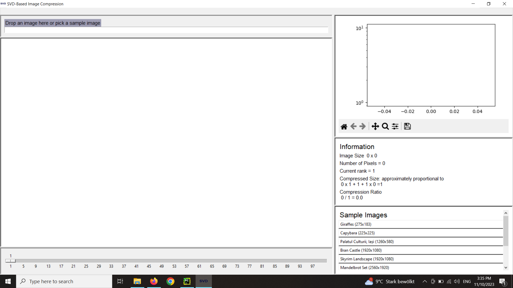
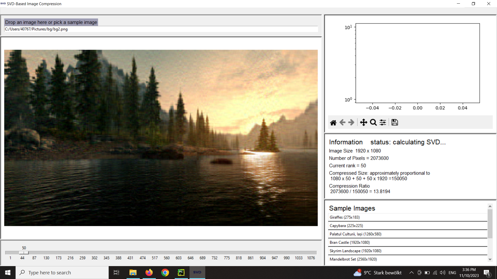
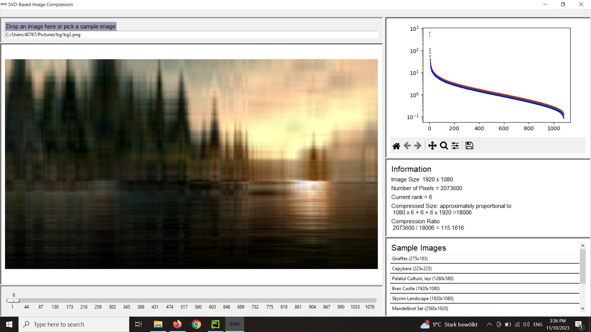
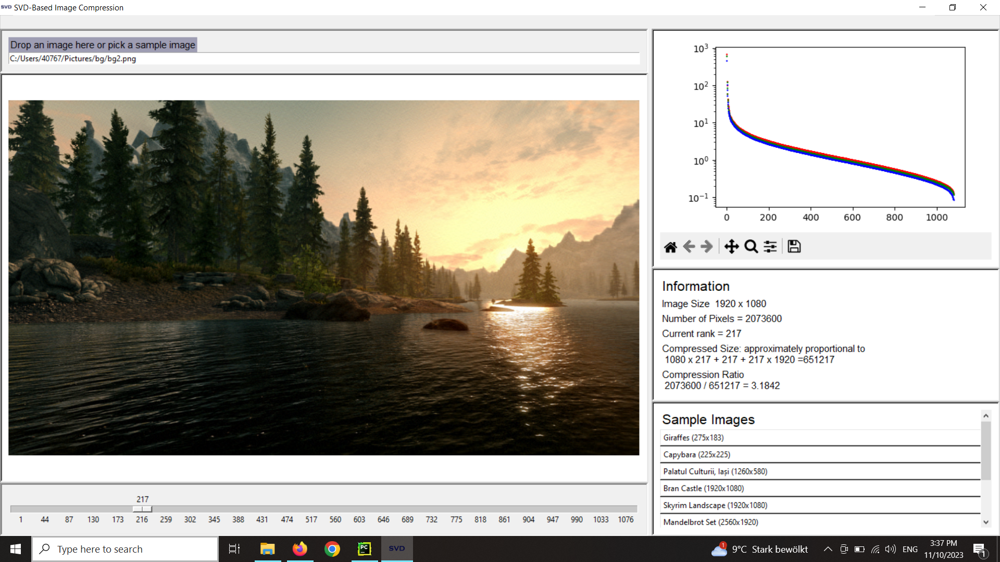
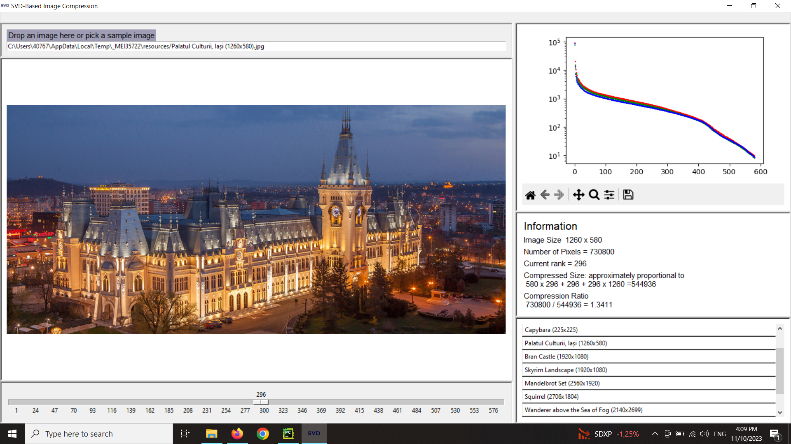
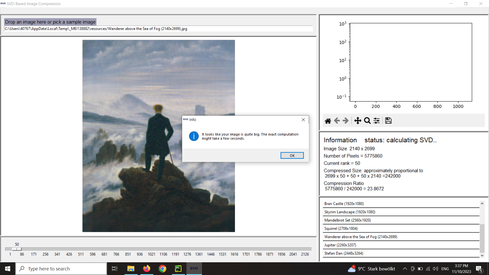

# SVD Image Compression App

This program computes approximations of an image (.png, .jpg etc.), 
based on the Singular Value Decomposition of the three channels
of the image. It allows to select a low rank approximation 
of every channel matrix, thus obtaining a compressed version
of the image. 

Images, seen as 3-channel tensors (RGB), although big, have in general only a handful of 
very large singular values in each channel that encode most
of the information, such that taking only the first, say 25,
singular values and singular vectors will result in a 
very good approximation of the image, yet, containing much
less information about the pixels than the original, thus
achieving a good compression rate.

Modern image formats like jpg take into account much more 
than just the values of the pixels, being far more efficient 
in practice. Therefore, this tool is designed for illustrative
purposes only, showing one of many applications of the 
powerful Singular Value Decomposition through a friendly
user interface.

## Demo

Initial state

Drop an image in the top-left field or write the path.
A 50-rank approximation of the image will be computed very
quickly and displayed, while the true SVD will be computed
in the background.

The slider at the bottom will be updated, with values from 1 to 
the maximal possible rank that a channel of the image can have
i.e. the minimum of the two dimensions of the image.
On the left, information about the image (size, number of 
pixels, current rank approximation, compression ratio etc.)
is displayed, as well as a status whether the SVD is still
being calculated.

The SVD has been computed. The singular values, colored 
for each channel (red, green, blue), are plotted on
the right.

One can move the slider to obtain other rank approximations
i.e. to increase or decrease the compression ratio.
At rank 50, for this image, it is 13.8194.

This is for rank 6. A compression ratio of over 100, yet
the image is still recognizable.

And this is for rank 217. Still a compression by a factor 
of 3, but the compressed image can barely be distinguished
from the original. (Note: the program does not check the 
true rank of each channel matrix, but it is highly improbable
that they are not full-rank - invertible matrices are dense
in the set of matrices)

For testing purposes, the program comes with 10 sample 
images, which can be selected from the bottom-right panel.

For example, one of them is a beautiful landmark from my hometown.

If the image is quite big, the computation might take a 
while, as computing the SVD is $O(m^2n+n^3)$, where $m$ and 
$n$ are the dimensions of the image.
In this case, a small note will appear, while the computation
still runs in the background.

The user interface layout was inspired by this 
beautiful website http://timbaumann.info/svd-image-compression-demo/.
